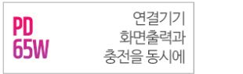

# 27ULD950 보충 PD 근거 — 사람 검토 자료

고정 기준: `1990262`. 상태: **사람 검토 미완료 / 화면 적용 미승인 / 공개 UNKNOWN**.
이 자료는 검토 준비와 표시 문구 제안이다. 실제 확인 결과나 승인 기록이 아니다.

## 검토 대상

| 항목 | 바인딩 |
|---|---|
| 제품·모델 | `product:crossover-27uld950` / `27ULD950` |
| 보충 batch | `crossover-pd-followup-2026-10-09` |
| 보충 assertion | `CROSS-PD-65W-SUPPLEMENT` |
| batch 전체 SHA-256 | `afea73c529ccabf53a36f3e4372677cf2ea48733564cece721cd9ce29c0e8d92` |
| 관련 원본 fact | `crossover-27uld950:site-2` |
| 원본 fact SHA-256 | `d1de1e84d1f083e5726855d364a40d33ee708c414c6ebd273b65b00901c5362d` |
| 발췌 캡처 SHA-256 | `45233da4e480b7bfc2274c6c423f701f9c26ec7fcf6bb4adf01edabe16627e9e` |
| 원문 확인 이력 | DIRECT_CHECK, 2026-10-09 (이전 에이전트 조사) |

[보충 근거 원본](../data/official/crossover_pd_followup_2026-10-09.json) · [구조화 보고서](CROSSOVER_PD_EVIDENCE_STRUCTURE_REPORT.md).

## 직접 대조할 자료

1. [공식 제품 페이지](https://www.crosslcd.co.kr/shop/item.php?it_id=1716533757)에서 모델 27ULD950과 상세 이미지 연결을 확인한다.
2. [해당 상세 이미지](https://www.crosslcd.co.kr/data/editor/2411/047dd0567fcc29d7226521dd0b0f9f78_1732598597_5708.jpg)의 앞부분 편의 특별기능 표에서 PD 65W와 연결기기 화면출력·동시충전 설명을 확인한다.
3. 아래 최소 발췌 캡처와 원문을 비교한다. 캡처만으로 현재 원문 포함 관계를 확정하지 않는다.

접근 제한·차단·로그인·CAPTCHA는 우회하지 않는다. 원문이 열리지 않으면 NEEDS_REVIEW로 남기고 이유를 기록한다. 검색 결과 제목·요약으로 확인을 대신하지 않는다.

## 체크리스트 — 아직 작성하지 않음

- [ ] 정확한 모델이 27ULD950인지, 다른 모델·변형 이미지가 아닌지 확인했다.
- [ ] 제품 페이지에 해당 상세 이미지가 포함되는지 확인했다.
- [ ] PD 65W가 상품명만이 아니라 기능 표에서 명시되는지 확인했다.
- [ ] 연결기기 충전 설명에 근거해 mode=OFFER가 적절한지 확인했다.
- [ ] MANUFACTURER_STATED가 제조사 표시의 의미이며 UP_TO/RATED를 뜻하지 않음을 확인했다.
- [ ] 정확한 공급 포트는 이번 근거로 확정하지 않고 interface=UNKNOWN으로 유지했다.
- [ ] 한국 판매 SKU/revision, 전압·전류 profile, 동시 전력 예산, 실제 Mac 수전은 미확인으로 유지했다.
- [ ] 원본 fact의 UNKNOWN과 역사적 부분 확인을 새 보충 근거로 덮어쓰지 않는지 확인했다.
- [ ] 아래 표시 제안이 완전 확인·호환성 승인으로 읽히지 않는지 검토했다.

검토자, 실제 확인 날짜, 확인 필드, 결과, 메모는 **미작성**이다. 생성된 체크리스트를 읽거나 테스트가 통과했다는 이유로 체크하지 않는다.

## 표시 문구 제안 — 현재 화면에는 미적용

| 위치 | 제안 문구·동작 | 유지할 제한 |
|---|---|---|
| 제품 상세의 별도 보충 근거 영역 | 제조사 상세 이미지에 PD 65W 표기가 있습니다. 정확한 공급 포트와 최대·정격 구분, 실제 기기 충전 전력은 미확인입니다. | 사람 검토 대기 및 근거 URL/기존 확인일 병기; 원본 사양과 분리 |
| 두 제품 비교 | 보충 근거: 제조사 표기 65W · 검토 대기 · 공급 포트 미확인 | 기존 원본 전력 셀 UNKNOWN 유지; 65W를 승인된 비교 수치·추천 순위로 계산하지 않음 |
| 공식 공급 기능 필터 | 현재 제외 유지 | 보충 근거만으로 공급 단자/조건까지 승인하지 않음 |
| 호환 결과 | 기존 UNKNOWN 유지 | 특정 Mac 충전 보장·호환성 확정 문구 사용 금지 |

제품 상세와 비교에 보충 근거를 노출할지는 별도 표시 검토 결정이다. 이 제안서 작성과 편집 검토 결과만으로 표시 기능을 활성화하지 않는다. 기존 사이트에 이 배치를 연결하는 코드는 추가하지 않았다.

## 검토 결과 기록 방법

[보충 근거 전용 절차](SUPPLEMENTAL_CONTENT_REVIEW_PROCEDURE.md)를 따른다. [기존 원본 fact ledger](../data/review/content_reviews.json)는 이 새 65W assertion의 검토 기록 장소가 아니다. 실제 확인 후 [보충 근거 ledger](../data/review/supplemental_content_reviews.json)에만 기록하고 검증한다.

- NEEDS_REVIEW: 원문 미접근·확인 부족. 확인한 필드가 없다면 reviewed_fields는 빈 배열이다.
- PARTIALLY_VERIFIED: mode/watts/rating_basis 중 일부를 실제로 확인했다. 확인한 필드를 명시한다.
- EVIDENCE_SUFFICIENT: 세 필드의 제한된 제조사 표시 근거를 모두 확인했다. **정확한 포트·SKU·실충전·호환성·공개 승인은 포함하지 않는다.**
- REJECTED: 해당 보충 assertion의 근거가 잘못 연결되거나 문구를 지지하지 않는다. 원본 파일을 삭제하지 않고 이유를 남긴다.

예정 결과를 기록하지 않는다. 표시 문구 채택 여부는 notes에 제안으로 기록할 수 있으나 자동 화면 적용은 없다.
