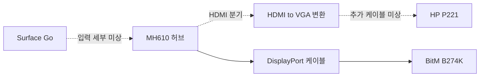

# 질문 코퍼스 스키마 v2

- 상태: **채택 / Authoritative v2** (ADR-006)
- 작성일: 2026-10-07
- 근거: [한국어 20건 파일럿](KOREAN_QUESTION_CORPUS_PILOT_REPORT.md), 사용자 명시적 채택
- 브랜치: `research/question-corpus-foundation`

질문 코퍼스의 유일한 기준 원본은 [정식 JSONL](../data/research/user_questions_v2.jsonl)이다.
[정식 JSON Schema](../schemas/user-question-v2.schema.json)가 자료형·필수 키·enum 기준이며,
[검증기](../scripts/validate_question_corpus_v2.py)가 참조·종결 근거·대수 규칙을 추가 검사한다.
[수집 지침 v2](QUESTION_COLLECTION_GUIDE_V2.md)와 [ADR-006](DECISIONS.md)을 따른다.

CSV는 JSONL에서 만드는 파생 요약으로 직접 수정하지 않는다. 현재 정식 JSONL에는 채택 당시 5건과 [1차 배치](QUESTION_CORPUS_V2_MIGRATION_BATCH_1_REPORT.md) 5건,
총 10건이 있다. 나머지 10건 이전과 추가 수집은 수행하지 않았다. v1과 proposed 아카이브는 과거 기록이다.
채택은 조사 구조의 확정이며 호환성 승인이나 공식 사양 확인을 의미하지 않는다.
[정식화 검증 기록](QUESTION_CORPUS_V2_ADOPTION_REPORT.md)을 참고한다.

## 1. 채택한 구조

게시물 하나를 사례 하나로 유지한다. 내부 ID와 원문 URL은 v1과 같다.
사례 안에서 **기기·포트 → 구성 → 시도 → 관측**을 분리한다. 목표는 관측과 독립적인 객체다.

```text
case
  source, case_classification, environment, evidence
  nodes, ports
  configurations (TARGET / OBSERVED / ADVICE)
  goal (목표 구성·목표 화면 수·목표 상태)
  attempts (실제 수행, 표현 순서 및 순서 확실성)
  observations (구성별 실제 상태, 지속성, 화면 수, 시간 근거)
  outcome (게시물 전체의 해결/종결 보고)
  configuration_conclusions (선택 배열: 특정 구성의 종결 결론)
  product_links (향후 별도 제품 목록 연결 후보)
  review, migration (검토 상태 및 v1 추적)
```

단순 configuration별 장치 배열은 작성은 쉽지만 분기·장치 순서가 다시 메모에 의존한다.
범용 전기 회로 모델은 포트·프로토콜·전원 추측을 늘린다. 여기서는 **기기 노드 + 포트 + 구성별 간선**을
사용한다. 케이블도 노드로 만들어 두 끝을 구분한다. 구성 간에 실제 동일하다고 확인되는 노드만 재사용한다.
순서가 미상인 중간 장치는 구성의 node_ids에 남기고 연결 세부는 UNKNOWN_GAP으로 보존한다.

UQ-0022의 알려진 두 출력 분기는 다음과 같다. 입력 케이블과 분기 내 생략된 구간은 부분 경로로 표시한다.



이 그래프는 배선의 사용자 보고를 저장한다. 물리 단자명으로 영상 프로토콜·대역폭·PD 지원을 판정하지 않는다.

## 2. 필드 사전과 결측 규칙

UTF-8, LF, JSONL 한 줄 한 사례. JSON 객체 안에 줄바꿈을 넣으면 이스케이프한다.
필수 배열은 빈 배열도 허용하되 schema의 minItems가 있으면 이를 따른다.
선택 값 미상은 키 생략, 상태 미상은 UNKNOWN. null·빈 문자열은 사용하지 않는다.
0은 확인된 0이며 미상 대수의 대체값이 아니다. 빠진 관측·조건은 review.missing_fields 및 notes에 기록한다.

아래에서 필수/선택은 **키의 존재**를 뜻한다. 필수 상태값이 UNKNOWN이면 근거가 있는 것처럼 읽지 않는다.
자세한 하위 속성과 enum은 JSON Schema를 따른다. 모든 객체는 정의하지 않은 키를 금지한다.

| 객체 | 필수 키 | 주요 선택 키·자료형 | 의미 |
| --- | --- | --- | --- |
| root | schema_version, id, case_classification, source, problem_type, environment, evidence, nodes, ports, configurations, goal, attempts, observations, outcome, product_links, review | migration, configuration_conclusions: object/array | schema_version은 `2`; id는 기존 UQ ID |
| source | source_url, site_name, checked_at, public_access, original_language, source_status | published_at: date | 원문 주소·접근 메타데이터. 확인일은 원문 확인일 |
| case_classification | types: string[], evidence_refs: string[] | notes: string, long_term_basis: object | 사례 유형은 복수 지정 가능, UNKNOWN은 단독 사용 |
| environment | evidence_refs | os_name, os_version: string | 작성자 보고 OS. 기기명만으로 채우지 않음 |
| evidence[] | id, kind, actor, location, checked_at, summary, origin | published_at: date, publication_sequence: positive integer; author_configuration_terminations: array; author_case_termination: object | 익명 원문 위치와 해당 보고의 출처 시점 |
| nodes[] | id, kind, identity_certainty, evidence_refs | display_model, normalized_model, manufacturer, family, chip, variant, notes: string; release_year: integer; display_scope: enum | 기기·장치를 한 번 정의. 제품 공식 사양 없음 |
| ports[] | id, node_id, connector, evidence_refs | reported_protocol, notes: string | 원문 단자와 원문 프로토콜 표기를 구분 |
| configurations[] | id, role, node_ids, edges, settings, topology_completeness, evidence_refs | notes: string | 특정 배선·설정 상태. TARGET과 OBSERVED는 별도 ID |
| edges[] | id, from_port, to_port, purpose, path_status, evidence_refs | notes: string | 두 포트 사이의 보고된 연결 또는 세부 미상의 연결 구간 |
| settings[] | key, value, evidence_refs | 없음 | 드라이버·전원·설정 조치 등 보고된 조건. value는 원문 요약 문자열 |
| goal | summary, configuration_ids, counts, display_states, evidence_refs | 없음 | 원하는 화면 수·성능·예정 구성. 성공 결과를 복제하지 않음 |
| attempts[] | id, sequence, sequence_basis, stage, configuration_id, action, observation_ids, evidence_refs | author_confirmed_on: date, relative_time: string | 작성자가 실제로 한 조치. 한 시도에 재발 등 복수 관측 허용 |
| observations[] | id, sequence, sequence_basis, configuration_id, summary, signal_state, durability, counts, display_states, clamshell, pd_charging, evidence_refs | observed_on: date, relative_time, recurrence_of: string; pd_watts: positive number | 특정 시점의 상태. 최종 실패 코드와 무신호 증상은 별개 |
| counts | scope, internal_screen_lit, basis, evidence_refs | connected, lit, independent_extended, mirrored: nonnegative integer; notes: string | 아래 정의로 목표와 관측에 각각 저장 |
| display_states[] | node_id, lit, evidence_refs | resolution: pixel string, resolution_label: string, hz: positive number, hdr/display_mode/output_mode: enum, notes: string | goal 안에서는 목표값, observation 안에서는 관측값 |
| outcome | status, summary, observation_ids, closure, evidence_refs | 없음 | 게시물 전체 결과와 근거. 시도별 증상을 전체 결과로 옮기지 않음 |
| product_links[] | node_id, catalog_id, resolution, evidence_refs | notes: string | 제품 목록 연결 후보. 사양 데이터 복제 금지 |
| review | reliability_grade, status, usable_for_compatibility, official_comparison, notes, missing_fields, commercial_context | 없음 | 현재 코퍼스은 NO/NOT_CHECKED만 허용 |
| migration | from_schema, source_file, source_record_id, row_sha256, migrated_at, legacy_outcome, notes | 없음 | v1의 해당 행을 추적. 신규 사례에는 migration 생략 가능 |

로컬 node/port/config/evidence/attempt/observation ID는 `^[a-z][a-z0-9_-]*$` 형태다.
각 종류 안에서 유일하고 다른 사례에서는 재사용할 수 있다. 로컬 ID는 모델 식별자나 작성자 식별자가 아니다.
`evidence_refs`는 항상 비어 있지 않으며 같은 사례의 evidence ID만 참조한다.
모델·포트 등 객체의 모든 보고 필드는 그 객체 evidence_refs에 묶인다. 같은 객체의 필드가 서로 다른
출처에서 보강되면 객체를 분리하거나 근거 목록에 모두 기록하고 notes에서 대응을 명시한다.
세밀한 필드별 주장 레지스트리는 현재 기준에 넣지 않았다.

## 3. 사례 유형

| 코드 | 포함 기준 | 경계 |
| --- | --- | --- |
| QUESTION | 이미 사용 중인 구성의 문제·방법을 묻는 실제 질문 | 해결 댓글이 붙어도 질문 출발을 유지 |
| TROUBLESHOOTING_REPORT | 본인 문제와 실제 시도·결과를 회고하는 해결/제한 기록 | 홍보 위주 글은 기존 제외 기준 유지 |
| PRE_PURCHASE_QUESTION | 구매·추가 연결 전에 목표 구성의 가능 여부 질문 | 질문이라는 의미로 QUESTION을 함께 부여할 필요 없음 |
| LONG_TERM_REPORT | 사용 기간 또는 장기간 사용이라는 본인 보고를 가진 후기 | 게시일이 오래됐다는 이유로 부여하지 않음 |
| UNKNOWN | 기존 요약만으로 글 성격을 판단할 수 없음 | 다른 유형과 함께 사용 금지 |

LONG_TERM_REPORT에는 long_term_basis(kind, summary, evidence_refs)가 필수다. kind는
USE_DURATION_REPORTED 또는 CONTINUED_USE_REPORTED다. 작성자 근거만 참조한다.

유형은 출처 등급과 결과를 바꾸지 않는다. 해결 후기+장기 사용 후기처럼 명시된 두 성격이 있으면 복수 유형을
허용한다. 기간 기준은 작성자 보고를 보존하며 임의로 “30일” 등의 문턱을 설정하지 않는다.
기존 CSV에는 새 컬럼을 추가하지 않고 v2의 case_classification에만 저장한다.

## 4. 연결과 구성의 역할

노드 유형: SOURCE, DISPLAY, CABLE, ADAPTER, HUB, DOCK, POWER_SOURCE, UNKNOWN_DEVICE.
HUB/DOCK는 원문 형태 분류이며 Thunderbolt·DisplayLink 지원을 보증하지 않는다.
DISPLAY의 display_scope는 EXTERNAL/INTERNAL/UNKNOWN이다.

포트 connector는 USB_C, USB_A, HDMI, DISPLAYPORT, MINI_DISPLAYPORT,
THUNDERBOLT_REPORTED, VGA, INTERNAL, UNKNOWN을 허용한다.
THUNDERBOLT_REPORTED는 원문이 단자 형태 없이 Thunderbolt 포트라고만 부른 경우의 보고 표기다.
정확한 단자가 확인되면 connector와 reported_protocol을 따로 사용한다. 표준 인증값으로 쓰지 않는다.

간선 purpose는 VIDEO/POWER/VIDEO_AND_POWER/UNKNOWN이다. POWER는 소스 충전 방향과
영상 방향이 반대일 수 있어 영상 그래프와 따로 읽는다. VIDEO_AND_POWER는 해당 연결의 두 용도가
보고됐다는 뜻이며 전원 흐름 방향까지 from→to로 단정하지 않는다.
현재 최소 구조은 전력 협상·방향·실제 W별 상세 전원 그래프를 지원하지 않는다.

path_status=REPORTED_LINK는 두 포트 사이의 연결을 보고한 경우다.
UNKNOWN_GAP은 알려진 장치 사이의 미기재 구간이며 케이블 하나 또는 직접 연결이라는 주장이 아니다.
topology_completeness=COMPLETE_REPORTED는 보고된 경로에 미상 구간이 없다는 뜻이다.
제품 사양·물리적 완전성의 검증 완료를 뜻하지 않는다. PARTIAL/UNKNOWN이면 빈 간선을 허용한다.

TARGET은 작성자가 원하는 구성, OBSERVED는 실제 시도한 구성, ADVICE는 타인이 스키마만 한 구성이다.
실제 observation과 attempt는 OBSERVED만 참조한다. goal은 TARGET만 참조한다.
ADVICE의 장치·설정을 실제 시도나 성공 근거에 자동 복제하지 않는다.

## 5. 여러 시도와 시간 근거

한 게시물에 최초·중간·최종·비교 구성을 따로 둔다. 같은 배선에서 설정만 바꾸면 configuration ID를
새로 만들고 기존 노드·포트를 재사용한다. 케이블 교체처럼 실물 변경이 확인되면 별도 노드를 만든다.
원문이 동일 기기인지 확인하지 않은 집/회사 화면은 임의 병합하지 않는다.

stage는 INITIAL/INTERMEDIATE/FINAL/COMPARISON/UNKNOWN이다. FINAL은 작성자가 마지막으로
사용했다고 보고한 구성이며, 항상 SUCCESS라는 뜻은 아니다. 최초 무신호를 FAILURE로 표시하지 않는다.

sequence는 1부터 시작하는 **표현 순서**다. 실제 시도 순서의 확실성은 sequence_basis에 둔다.

- REPORTED_SEQUENCE: 작성자가 순서를 명시했다.
- RECONSTRUCTED_PARTIAL: 기존 요약에서 앞뒤 일부만 복원했다. 모든 순서가 확정됐다고 읽지 않는다.
- UNORDERED: 비교 환경 등 실제 전후를 알 수 없다. sequence는 표시·정렬용이다.

published_at은 게시 날짜, checked_at은 실제 본문 확인 날짜다.
observed_on/author_confirmed_on은 본인이 시험/확인했다고 명시한 날짜가 있을 때만 적는다.
게시일을 관측일로 대입하지 않는다. 상대 시점만 알면 relative_time에 “재부팅 후”처럼 기록한다.
publication_sequence는 원글→후속댓글→본문수정 등 게시 순서가 확인되는 경우만 사용한다.

evidence.kind는 ORIGINAL_POST/AUTHOR_COMMENT/EDITED_POST/OTHER_COMMENT다.
actor는 CASE_AUTHOR/OTHER/UNKNOWN이며 사용자명은 없다. 위치는 날짜·절·익명 댓글 역할로 표현한다.
OTHER_COMMENT는 조언으로 남길 수 있으나 관측·실제 시도·그 구성의 설정·게시물 결과 근거에는 사용하지 않는다.
본문이 수정됐다는 사실이나 수정 시각을 확인하지 못하면 EDITED_POST를 만들어내지 않는다.

origin=MIGRATED_V1는 기존 수집 기록을 이용한 재구조화이며 신규 원문 재확인이 아니다.
DIRECT_CHECK는 향후 실제 원문을 다시 확인할 때만 사용한다. 채택 당시 5건은 모두 MIGRATED_V1이다. 1차 배치에서는 실제 재확인 근거만 DIRECT_CHECK로 기록한다.

## 6. 결과와 지속성

결과 status는 v1의 다섯 코드를 유지한다. 시도별 observation.signal_state와 혼합하지 않는다.

| status | 의미 | 허용 closure |
| --- | --- | --- |
| SUCCESS | 작성자가 해당 목표 달성을 보고 | GOAL_MET_REPORTED |
| LIMITED_SUCCESS | 일부 기능·성능 또는 조건·일시 효과만 달성 | PARTIAL_OR_CONDITIONAL |
| FAILURE | 작성자가 해당 구성의 최종 실패 또는 사용 포기를 명시 | FINAL_FAILURE_REPORTED, ABANDONED_REPORTED |
| UNRESOLVED | 문제 질문이나 시도가 남아 있고 해결·종결 확인 없음 | OPEN |
| UNKNOWN | 실제 결과 정보 없음, 구매 전 질문 등 | UNKNOWN |

FAILURE의 closure에 근거 위치와 요약을 반드시 연결한다. 무신호 관측 한 번 또는 작성자의 후속 답변 부재만으로
FAILURE를 만들지 않는다. 시도에서 실패 증상이 있어도 최종 구성이 성공하면 게시물 결과는 SUCCESS일 수 있다.
특정 구성의 최종 포기가 명시됐지만 다른 구성은 성공한 경우 configuration_conclusions에 따로 기록하고
게시물 결과는 목표 달성을 기준으로 정한다. 관측 summary에만 포기를 기록하지 않는다.

**TEMPORARY_SUCCESS를 새 outcome enum으로 추가하지 않는다.** 성공의 정도와 지속성을
같은 축에 넣으면 “낮은 해상도이지만 오래 유지”, “목표 해상도이나 재부팅 후 재발”을 표현하기 어렵다.
observations.durability에 TEMPORARY/RECURRENT/NO_RECURRENCE_REPORTED/UNKNOWN을 둔다.
재발 관측은 recurrence_of로 앞선 NORMAL 관측에 연결한다. 두 관측은 동일 사례 안에서 작성자 근거를 갖는다.
NO_RECURRENCE_REPORTED는 조사 시점까지 재발 보고가 없다는 뜻이며 장기 안정 보증이 아니다.

UQ-0009는 일시 NORMAL/TEMPORARY와 후속 INTERMITTENT/RECURRENT를 따로 저장하면서
전체 LIMITED_SUCCESS를 유지한다. 원인과 조치의 인과관계는 이 기록만으로 확정하지 않는다.

## 7. 화면 수와 목표·실제 구분

counts는 goal과 각 observation에 별도로 있다. scope를 먼저 읽는다.
EXTERNAL_ONLY는 외장만, INCLUDING_INTERNAL은 내장도 포함, UNKNOWN은 포함 범위 미상이다.
internal_screen_lit은 YES/NO/UNKNOWN이며 내장 사용 여부가 미상이면 세지 않는다.
덮개 상태와 점등 상태를 같다고 자동 계산하지 않는다.

| 필드 | 정의 |
| --- | --- |
| connected | 해당 구성에 물리적으로 연결·참여한 화면 수. 인식·점등 수가 아님 |
| lit | 영상이 실제로 표시된 화면 수. 전원 LED만 켜진 수가 아님 |
| independent_extended | 다른 화면과 복제되지 않는 확장 모드 화면의 물리 대수 |
| mirrored | 복제 그룹에 속한 물리 화면 대수. 기준 화면을 제외한 “추가 복제 수”가 아님 |

복제 그룹의 기준 화면도 mirrored에 포함하고 independent_extended에는 넣지 않는다.
따라서 외장 두 대가 같은 영상을 보이면 lit=2, mirrored=2, independent_extended=0이다.
이는 OS가 감지한 논리 출력 수 1과 별개다. 독립 이미지 개수 자체는 이번 counts에 포함하지 않는다.
혼합 구성에서 확장 화면과 복제 화면의 구성원 수를 더한 값은 lit보다 클 수 없다.
각 상태값이 알려졌을 때만 connected≥lit, lit≥independent_extended/mirrored를 검사한다.

basis=AUTHOR_REPORT는 직접 보고한 수, SUMMARY_INTERPRETATION은 기존 명확한 설명을 이 정의로
분해한 값, UNKNOWN은 대수 미상이다. UQ-0007의 복제 대수 분해는 해석임을 명시한다.
알 수 없는 수치는 키를 생략한다. lit=2라는 것만으로 independent_extended=2를 생성하지 않는다.

디스플레이별 목표 성능은 goal.display_states, 실제 성능은 observations.display_states에 있다.
4K/FHD는 resolution_label에 두고 픽셀 수를 추측하지 않는다. 실제 Hz는 해당 관측에만 묶는다.
HDR·미러링을 설정 전후로 바꾼 경우 서로 다른 observation으로 기록한다.

## 8. 공식 사양과 향후 연결

코퍼스에는 사용자 관측과 사용자가 부르는 기기·단자·조건만 둔다. 공식 모델별 포트·대역폭·최대 해상도·
화면 수·PD 조건은 별도 제품/공식 근거 데이터셋에서 관리한다. 현재 코퍼스은 그 데이터셋을 만들지 않는다.

향후 제품 데이터셋은 불변 `product:<opaque-id>`를 키로 쓰고 공식 출처·국가/세대·갱신일을 관리하도록 제안한다.
코퍼스 product_links에는 node_id, catalog_id, resolution=CANDIDATE와 그 모델 표기 근거만 둔다.
현재 enum은 CANDIDATE만 허용한다. 확정 연결은 향후 별도 모델 해석·공식 근거 검수 단계에서 설계한다.
모델 문자열 해시나 이름 동일성만으로 자동 연결·확정하지 않는다. 제품 사양 수정은 코퍼스 관측을 바꾸지 않는다.

공식 대조 결과는 장래 별도의 comparison ID로 case ID + configuration ID + observation ID와 공식 근거 ID를
연결하는 방식을 검토한다. 비교 dataset과 승인 절차가 없으므로 코퍼스 review는
usable_for_compatibility=NO, official_comparison=NOT_CHECKED만 허용한다.
MVP 범위와 신뢰등급 정책은 기존 결정대로 유지한다.

## 9. 마이그레이션과 검증의 한계

기존 파일을 덮어쓰지 않고 동일 UQ ID의 다른 버전 표현을 만든다. v1↔v2의 같은 ID/URL은 버전 대응이며
새 사례나 중복 수집이 아니다. v2 안의 ID/정규화 URL 중복은 오류다. 채택 당시 5건과 1차 배치 5건의 ID·원문 근거는 각 작업 보고서에서 확인한다.

migration.row_sha256은 csv.DictReader의 전체 문자열 행을 ensure_ascii=False, sort_keys=True,
separators=(',', ':')로 JSON 직렬화한 UTF-8 SHA-256이다. 파일 전체 바이트 해시와 구분한다.
원본의 결측·공식 대조·독립 사례 수 등 v2에서 재구조화하지 않은 필드는 기존 행에 보존한다.
전체 데이터 자동 변환·역변환 도구는 만들지 않는다.

검증기는 stdlib 기반이다. 현재 Schema의 사용 키워드와 참조·타인 조언·화면 수·순서·재발·결과 종결과 아래의 명시 종결 근거를 검사한다.
범용 JSON Schema 엔진이나 사실 검증기는 아니다. schema에 미지원 키워드/format이 추가되면 실패한다.
공식 Draft 2020-12 엔진 도입은 채택 후 별도 결정이며 현재 구현에는 외부 의존성이 없다.

개인정보 금지와 원문 복제 금지는 그대로 적용한다. 이메일·휴대전화·키·토큰 패턴 검사는 보조 수단이다.
닉네임·의미상 중복·정확한 작성자 역할·최종 포기 진위·광고 경계는 사람 검수가 필요하다.
UQ-0012의 판매·제휴 링크가 있는 본인 시험 기록은 포함하며 상업성·포함 근거를 review.commercial_context에 기록한다.
상품 소개·판매 유도가 중심이고 본인 실사용 근거가 불충분하면 제외한다.

## 10. 구성별 결론과 명시 종결 근거

configuration_conclusions는 선택 배열이다. 생략 또는 []이면 기록 가능한 구성별 종결 결론이 없다는 뜻이며
연결 실패나 성공이 없었다는 주장이 아니다. 한 configuration_id에는 하나의 최종 확인 결론만 둔다.
새 결론을 기록해도 앞선 observation과 evidence는 지우지 않는다.

| 필드 | 자료형·필수 여부 | 정의 |
| --- | --- | --- |
| configuration_id | 로컬 ID, 필수 | 실제 OBSERVED 구성 참조. TARGET/ADVICE는 허용하지 않음 |
| status | enum, 필수 | SUCCESS / LIMITED_SUCCESS / FAILURE |
| termination_type | enum, 필수 | GOAL_MET_REPORTED / PARTIAL_OR_CONDITIONAL / FINAL_FAILURE_REPORTED / ABANDONED_REPORTED |
| evidence_refs | 비어 있지 않은 ID 배열, 필수 | 실제 결론의 작성자 근거 |
| observation_ids | ID 배열, 선택 | 있으면 비어 있지 않아야 하며 모두 해당 구성의 관측 참조 |
| summary | 1~300자 string, 필수 | 짧은 사실 요약. 원문 전체 복제 금지 |

status와 termination_type의 허용 조합은 outcome의 동일 의미 코드와 같다.
SUCCESS는 GOAL_MET_REPORTED, LIMITED_SUCCESS는 PARTIAL_OR_CONDITIONAL,
FAILURE는 FINAL_FAILURE_REPORTED 또는 ABANDONED_REPORTED만 허용한다.
미해결·결과 미상은 종결 결론을 만들지 않고 observations/outcome에 남긴다.

실패·포기의 명시 근거는 같은 evidence 객체 안에 다음 선택 배열로 구조화한다.

```text
evidence.author_configuration_terminations[]
  configuration_id
  termination_type: FINAL_FAILURE_REPORTED | ABANDONED_REPORTED
  summary: 작성자가 해당 구성의 최종 실패/포기를 명시한 진술의 짧은 요약 (1~300자)
```

구성 FAILURE의 evidence_refs 안에 CASE_AUTHOR 근거가 있고, 그 근거의 선언이 동일한 configuration_id와
termination_type을 가져야 한다. 명시 진술의 위치는 evidence.location에 기록한다.
관측 NO_SIGNAL, 재부팅 후 재발, 답변 부재, 전체 outcome SUCCESS/FAILURE 또는 타인의 제안은 이 선언을 대신하지 못한다.
observation_ids는 선택이므로 상세 관측 없이도 작성자의 명시 진술 자체로 종결을 기록할 수 있다.

전체 outcome FAILURE는 별도로 evidence.author_case_termination(termination_type, summary)을 참조해야 한다.
구성 하나의 포기 근거를 전체 목표 포기로 확대하지 않는다. 반대로 전체 outcome이 성공해도 앞선 특정 구성의
FAILURE를 금지하거나 덮어쓰지 않는다. FAILURE 비율 목표는 없다.

자동 검사에서는 작성자 역할·구성 범위·근거 참조·종결 유형·요약의 존재와 길이를 확인한다.
입력자가 거짓으로 선언 유형을 부여한 경우나 실제 문구가 최종 종결을 뜻하는지는 원문을 읽는 사람이 확인해야 한다.
명시 선언을 찾지 못하면 실패 결론을 만들어 채우지 않는다. 채택 당시와 1차 배치 총 10건에는 구성 FAILURE/포기 선언을 새로 만들지 않았다.

## 11. 상업성 검토 정보

review.commercial_context는 필수 객체다. sales_links, affiliate_links, advertising는 YES/NO/UNKNOWN,
inclusion_basis는 구체적인 본인 사용 과정·결과를 근거로 한 짧은 포함 사유, evidence_refs는 그 근거다.
notes는 선택 검토 메모다. 판매 링크 존재와 협찬·광고성 의도는 같지 않다.
확인하지 못한 광고·제휴 여부를 NO로 추정하지 않는다. 판매 URL·제휴 추적값은 저장하지 않는다.

현재 자료에 상업성 정보가 없으면 UNKNOWN을 기록하고 원문 재검수 필요를 notes에 남긴다.
이 상태만으로 자료를 홍보 글이라고 단정하거나 수집에서 자동 제외하지 않는다.
본인 실사용 근거가 부족한 상품 소개·판매 유도 글은 코퍼스에 넣지 않는다.
